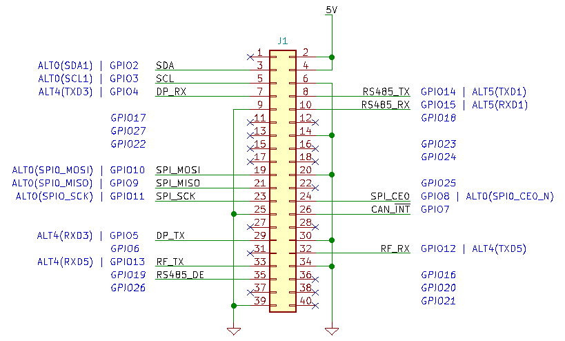

Raspberry pi Setting
====================

라즈베리파이 제원
-----------------

  * Hardware : `Raspberry pi 4B <https://datasheets.raspberrypi.com/rpi4/raspberry-pi-4-datasheet.pdf>`_
  * OS : Ubuntu 20.04 LTS
  * Robot System : `ROS2 <https://docs.ros.org/en/foxy/index.html>`_

  * **Id : ubuntu**
  * **Password : snutt123**

라즈베리파이 핀맵
---------------------

- 라즈베리 파이의 핀맵은 위와 같이 할당되어 있습니다.
- 더 자세한 연결 관계는 :ref:`보드 회로도<board-schematic>` 를 참고하시기 바랍니다.

.. _ssh-connect:

라즈베리파이 원격접속
---------------------

- 개발을 위해서는 라즈베리 파이에 원격 접속 해야 합니다.
- 원격 접속을 하려면 라즈베리파이와 같은 네트워크에 연결되어 있어야 합니다. 원격접속은 다음과 같은 방법을 선택할 수 있습니다.

  1. **라즈베리파이 랜포트 연결**

    - 라즈베리파이의 랜포트를 공유기에 연결하고, 개발 컴퓨터 또한 같은 공유기에 접속합니다. 그 후, 공유기 설정정보창으로부터 라즈베리파이의 IP를 알아냅니다.

  2. **USB WIFI 동글을 이용한 연결**

    - 기본적으로 라즈베리파이 4는 보드에 와이파이 모듈이 이미 달려 있습니다. 하지만 현재 라즈베리파이의 위치가 신호를 수신하기에는 좋지 않기 때문에, 리눅스 호환이 되는 USB 와이파이 동글을 사용하는 것을 추천드립니다.

- 라즈베리파이의 IP정보를 알아 내었으면, **다음과 같은 방법으로 원격 접속** 을 진행합니다.

  1. 명령 프롬프트 창을 실행합니다. (윈도우 기준)
  2. 명령어 창에 다음과 같이 입력 (여기서 192.168.0.5에 해당하는 부분에 위에서 알아낸 IP 주소를 입력해 주세요)

  .. code::

        $ ssh ubuntu@192.168.0.5

  3. 올바른 IP를 입력하였다면 비밀번호를 치는 창이 나오고, 여기에 **rodel123** 을 입력합니다. (비밀번호는 키보드를 누르더라도 화면에 나타나지 않습니다)
  4. 정상적으로 연결되었다면 개발 및 프로그램 실행 준비가 완료된 것입니다.