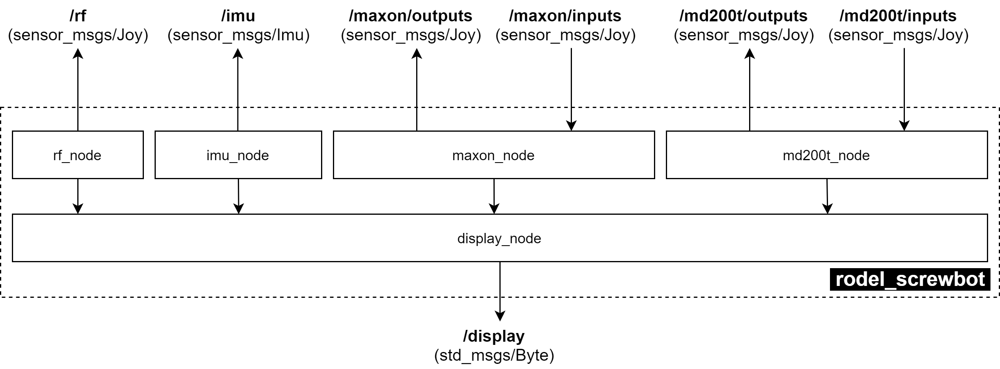

.. _ros2-package:

ROS2 로봇 패키지
===================

- 현재 로봇 제어를 위한 ROS2 패키지는 `여기 <https://github.com/rodel-hyu/rodel_screwbot>`_ 에서 볼 수 있으며, 라즈베리 파이의  **/home/ubuntu/dev_ws/src/rodel_screwbot** 에 저장 되어 있습니다.

- **rodel_screwbot** 패키지는 다음과 같은 노드들로 구성되어 있습니다.
- 각 노드들이 publish 및 subscribe 하는 데이터는 ros2 topic echo(`참고 <https://docs.ros.org/en/foxy/Tutorials/Topics/Understanding-ROS2-Topics.html#ros2-topic-echo>`_)를 통해서 확인 바랍니다.

rf_node
-------
 - publish : **/rf (@ ~30Hz)** (`sensor_msgs/Joy <https://docs.ros.org/en/api/sensor_msgs/html/msg/Joy.html>`_)

 - source code : `src/rf_node.cpp <https://github.com/rodel-hyu/rodel_screwbot/blob/master/src/rf_node.cpp>`_

 - description

   * `APC220 <https://www.dfrobot.com/product-57.html>`_ 모듈로부터 들어온 데이터를 publish 함.

   .. code::

        /rf {
          axes[0] : 조종기 조이스틱 1번의 값 (0.0 ~ 1.0)
          axes[1] : 조종기 조이스틱 2번의 값 (0.0 ~ 1.0)

          buttons[0] : 버튼 1번 값 (0: 안눌림, 1 : 눌림)
          buttons[1] : 버튼 2번 값 (0: 안눌림, 1 : 눌림)
          buttons[2] : 버튼 3번 값 (0: 안눌림, 1 : 눌림)
          buttons[3] : 버튼 4번 값 (0: 안눌림, 1 : 눌림)
        }

imu_node
--------
 - publish : **/imu (@ 100Hz)** (`sensor_msgs/Imu <https://docs.ros.org/en/api/sensor_msgs/html/msg/Imu.html>`_)

 - source code : `src/imu_node.cpp <https://github.com/rodel-hyu/rodel_screwbot/blob/master/src/imu_node.cpp>`_

 - description

   * `BNO055 <https://learn.adafruit.com/adafruit-bno055-absolute-orientation-sensor>`_ 모듈로부터 들어온 데이터를 publish 함.

   .. code::

       /imu {
         orientation {
           x : BNO055으로부터 계산된 Quaternion 자세 값 x
           y : BNO055으로부터 계산된 Quaternion 자세 값 y
           z : BNO055으로부터 계산된 Quaternion 자세 값 z
           w : BNO055으로부터 계산된 Quaternion 자세 값 w
         }

         angular_velocity[0] : BNO055으로부터 측정 된 각속도 x [rad/s]
         angular_velocity[1] : BNO055으로부터 측정 된 각속도 y [rad/s]
         angular_velocity[2] : BNO055으로부터 측정 된 각속도 z [rad/s]

         linear_acceleration[0] : BNO055으로부터 측정 된 가속도 x [m/s^2]
         linear_acceleration[1] : BNO055으로부터 측정 된 가속도 x [m/s^2]
         linear_acceleration[2] : BNO055으로부터 측정 된 가속도 x [m/s^2]
       }

maxon_node
----------
 - publish : **/maxon/outputs (@ 50Hz)** (`sensor_msgs/Joy <https://docs.ros.org/en/api/sensor_msgs/html/msg/Joy.html>`_)
 - subscribe : **/maxon/inputs** (`sensor_msgs/Joy <https://docs.ros.org/en/api/sensor_msgs/html/msg/Joy.html>`_)

 - source code : `src/maxon_node.cpp <https://github.com/rodel-hyu/rodel_screwbot/blob/master/src/maxon_node.cpp>`_

 - description

   * 4개의 EPOS4를 제어하는 노드
   * 1번과 3번 드라이버는 **위치제어모드** 로 설정되어 있으며, 2번과 4번은 **속도제어모드** 로 설정 함.

   .. code::

        /maxon/inputs {
          buttons[0] : 1번 모터 드라이버 지령값 업데이트 (0: 업데이트 하지 않음, 1: 업데이트)
          buttons[1] : 2번 모터 드라이버 지령값 업데이트 (0: 업데이트 하지 않음, 1: 업데이트)
          buttons[2] : 3번 모터 드라이버 지령값 업데이트 (0: 업데이트 하지 않음, 1: 업데이트)
          buttons[3] : 4번 모터 드라이버 지령값 업데이트 (0: 업데이트 하지 않음, 1: 업데이트)
 
          axes[0] : 1번 모터드라이버 위치 지령 값 [inc]
          axes[1] : 2번 모터드라이버 속도 지령 값 [inc/s]
          axes[2] : 3번 모터드라이버 위치 지령 값 [inc]
          axes[3] : 4번 모터드라이버 속도 지령 값 [inc/s]
        }

   .. code::

        /maxon/outputs {
          buttons[0] : 1번 모터 드라이버 statusword
          buttons[1] : 2번 모터 드라이버 statusword
          buttons[2] : 3번 모터 드라이버 statusword
          buttons[3] : 4번 모터 드라이버 statusword
 
          axes[0] : 1번 모터드라이버 현재 위치 값 [inc]
          axes[1] : 2번 모터드라이버 현재 속도 값 [inc/s]
          axes[2] : 3번 모터드라이버 현재 위치 값 [inc]
          axes[3] : 4번 모터드라이버 현재 속도 값 [inc/s]
        }

md200t_node
-----------
 - publish : **/md200t/outputs** (`sensor_msgs/Joy <https://docs.ros.org/en/api/sensor_msgs/html/msg/Joy.html>`_)
 - subscribe : **/md200t/inputs** (`sensor_msgs/Joy <https://docs.ros.org/en/api/sensor_msgs/html/msg/Joy.html>`_)

 - source code : `src/md200t_node.cpp <https://github.com/rodel-hyu/rodel_screwbot/blob/master/src/md200t_node.cpp>`_

 - description

   * MD200T 모터드라이버의 2개의 모터를 제어하는 노드

   .. code::

        /md200t/inputs {
          buttons[0] : 1번 모터 활성화 (0: 비활성화, 1: 활성화)
          buttons[0] : 2번 모터 활성화 (0: 비활성화, 1: 활성화)

          axes[0] : 1번 모터 속도 지령 값 [rpm]
          axes[1] : 2번 모터 속도 지령 값 [rpm]
        }

   .. code::

        /md200t/outputs {
          axes[0] : 1번 모터 현재 속도 값 [rpm]
          axes[1] : 2번 모터 현재 속도 값 [rpm]
        }

display_node
------------
- publish : **/display** (`std_msgs/Byte <http://docs.ros.org/en/noetic/api/std_msgs/html/msg/Byte.html>`_)
- subscribe : **/rf, /imu, /maxon/outputs, /md200t/outputs**

 - source code : `src/display_node.cpp <https://github.com/rodel-hyu/rodel_screwbot/blob/master/src/display_node.cpp>`_

 - description

   * 위의 모든 노드를 subscription 하며, 이를 통해 디스플레이에 표시
   * 화면에 있는 버튼 입력을 읽어 이를 publish 함

   .. code::

       /display {
         data : 버튼 입력 번호
       }