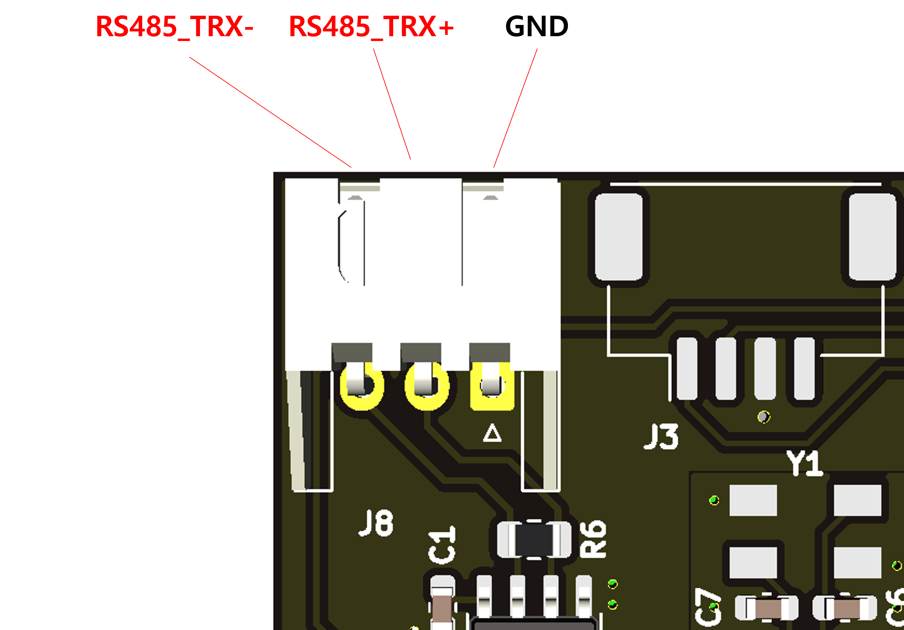

Hardware Setup
==============

MD200T Motor driver 연결
--------------------------

1. 각 모터의 홀센서 커넥터를 MD200T의 홀센서 커넥터에 연결합니다.

2. 모터의 3상 선을 MD200T의 모터 선에 연결합니다. 이때, **모터 드라이버의 UVW 순서와 모터의 UVW 순서가 다르므로** 아래와 같이 연결해야 정상적으로 동작합니다.

  * 모터 드라이버 U (빨강) <-> 모터 W (파랑)
  * 모터 드라이버 V (흰색) <-> 모터 U (노랑)
  * 모터 드라이버 W (검정) <-> 모터 V (초록)

3. 모터 드라이버의 RS485 통신선을 메인보드의 RS485 커넥터에 연결합니다. (아래 그림 참고)

Maxon EPOS4 연결
--------------------

- 현재 총 4개의 EPOS4가 전장 시스템에 CAN 케이블을 통해 연결되어 있습니다.
- 각 EPOS4는 ID 1 ~ 4로 할당되어 있으며(DIP 스위치 참고), 다음의 모터들로 튜닝되어 있습니다.

  * ID 1 : Maxon Motor
  * ID 2 : Motorbank Motor
  * ID 3 : Maxon Motor
  * ID 4 : Motorbank Motor

- 각 설정에 맞게 모터를 연결하시기 바랍니다.