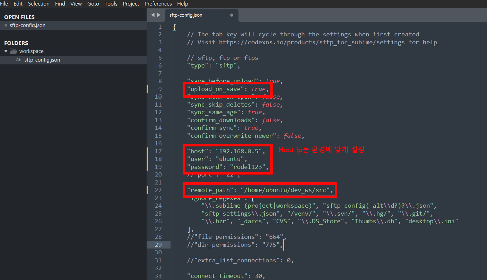
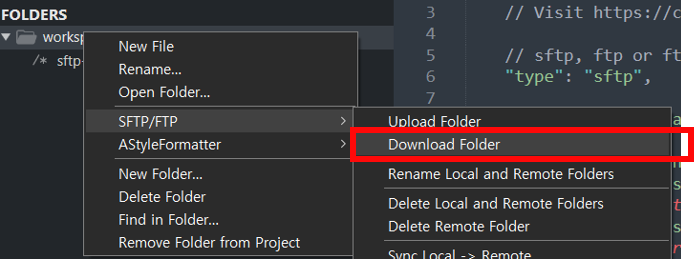

코드 수정하기
====================

- 현재 라즈베리파이에 직접 키보드와 모니터를 연결한 상태가 아닌 원격으로 코드를 수정해야 할 필요성이 있어, 해당 작업을 쉽게 할 수 있도록 작업환경을 세팅해야 합니다.

- 이를 위한 여러가지 방법이 있지만, **sftp** 를 이용하면 손쉽게 원격으로 코드 수정이 가능합니다.

- 해당 문서에서는 `Sublime Text SFTP 설정 <https://kkamikoon.tistory.com/entry/Sublime-Text-3-SFTP-%EC%84%A4%EC%A0%95%ED%95%98%EA%B8%B0>`_ 문서를 기반으로 세팅하는 방법을 설명합니다.

sftp-config.json 설정하기
-----------------------------

- 위의 링크를 통해 Sublime text 설치 및 SFTP 패키지 설치가 끝나면 다음과 같이 sftp-config.json을 설정합니다.

